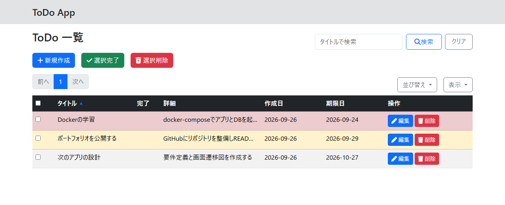
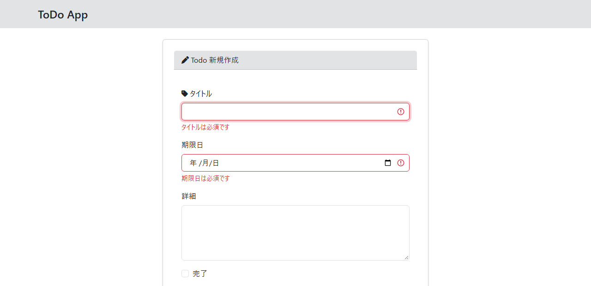
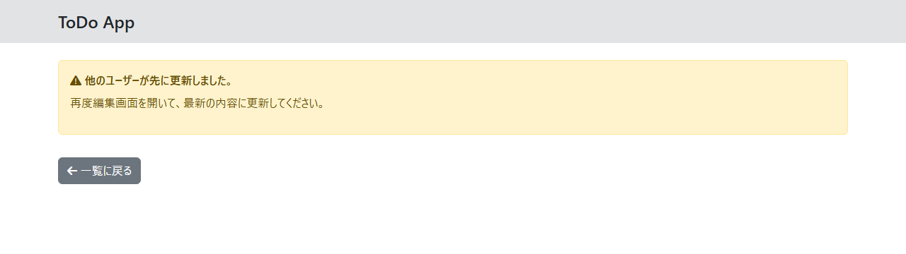

# todoclean

Spring Boot と Thymeleaf で作った ToDo 管理 Web アプリです。
CRUD に加えて検索・絞り込み・ソート・ページネーション・一括操作・楽観ロックを実装しています。



期限切れの ToDo は赤、期限が 3 日以内の ToDo は黄色で表示します。

| 入力バリデーション | 更新競合（楽観ロック） |
| --- | --- |
|  |  |

## 主な機能

- ToDo の作成・一覧・編集・削除
- タイトルのキーワード検索
- 完了 / 未完了 / すべて の絞り込み（既定は未完了のみ）
- 期限日・作成日時・タイトルでのソート
- ページネーション（1 ページ 10 件）
- チェックした ToDo の一括完了・一括削除
- 入力バリデーション（タイトル必須・50 文字以内、詳細 200 文字以内、期限日必須）
- 楽観ロックによる同時更新の検出（競合時は 409 画面を表示）

## 使用技術

| 分類 | 技術 |
| --- | --- |
| 言語 | Java 21 |
| フレームワーク | Spring Boot 4.0.7（Spring MVC / Spring Data JPA / Bean Validation） |
| テンプレート | Thymeleaf |
| フロントエンド | Bootstrap 5, Font Awesome（CDN） |
| DB | MySQL 8 |
| ビルド | Maven（Maven Wrapper 同梱） |
| テスト | JUnit 5, Mockito, MockMvc |
| 実行環境 | Docker / Docker Compose |

## 起動方法

### Docker Compose で起動する（推奨）

前提: Docker Desktop がインストール済みであること（Windows の場合は WSL2 が必要です。未導入なら `wsl --install`）。

1. 環境変数ファイルを作成し、パスワードなどを設定します。

   ```bash
   cp .env.example .env
   ```

2. アプリと DB をビルドして起動します。

   ```bash
   docker compose up --build
   ```

3. ブラウザで http://localhost:8080/todo を開きます。

初回起動時に `data.sql` のサンプルデータが投入されます（テーブルが空の場合のみ）。
MySQL はホストの `3307` 番ポートでも公開しています。
初回起動時は MySQL の初期化に数秒〜十数秒かかり、アプリはその完了を待ってから起動します。

DB を初期化し直したい場合は、ボリュームごと削除してから起動します（登録したデータはすべて消えます）。

```bash
docker compose down -v
```

### ローカルで直接起動する

前提: JDK 21 がインストール済みであること。
ローカルの MySQL（`localhost:3306`）に `todo` データベースとユーザーを用意したうえで実行します。
接続情報は環境変数 `SPRING_DATASOURCE_URL` / `SPRING_DATASOURCE_USERNAME` / `SPRING_DATASOURCE_PASSWORD` で上書きできます。

```bash
./mvnw spring-boot:run
```

## テスト

```bash
./mvnw test
```

- `TodoServiceTest`: Mockito でリポジトリをモック化した Service 層の単体テスト
- `TodoControllerTest`: `@WebMvcTest` + MockMvc による Controller 層のテスト
- `TodoCleanApplicationTests`: コンテキスト起動確認（DB 接続が必要）

## ディレクトリ構成

```
src/main/java/com/example/todoclean/
├── controller/   # 画面遷移とリクエスト処理
├── service/      # 業務ロジック・トランザクション
├── repository/   # Spring Data JPA リポジトリ
├── entity/       # JPA エンティティ
├── dto/          # 画面との入出力用オブジェクト（作成用・更新用・表示用）
└── exception/    # 例外と @ControllerAdvice によるエラー画面の振り分け
src/main/resources/
├── templates/    # Thymeleaf テンプレート（todo/, error/）
├── application.properties
└── data.sql      # サンプルデータ
```

## 設計・実装で工夫した点

- **レイヤー分割と DTO**
  Controller / Service / Repository を分け、エンティティを画面に直接渡さず、作成用・更新用・表示用の DTO を用意しました。

- **楽観ロック**
  エンティティに `@Version` を付与し、編集画面を開いた時点の version をフォームで持ち回して更新時に比較しています。
  HTTP リクエストをまたぐと Hibernate の管理状態が切れるため、明示的な比較が必要になる点に注意しました。
  一括完了も `@Modifying` の一括 UPDATE ではなくエンティティ経由で更新し、version が正しく進むようにしています。

- **一覧の状態保持**
  作成・編集・削除のあとも、元の検索キーワード・絞り込み・ソート・ページ番号を維持したまま一覧へ戻るようにしています。

- **エラーハンドリング**
  `@ControllerAdvice` で例外を集約し、存在しない ID は 404、更新競合は 409、不正なパラメータは 400 の画面を表示します。

- **Docker 化**
  マルチステージビルドで実行イメージを JRE のみに軽量化し、DB のヘルスチェックが通ってからアプリを起動するようにしています。
  接続情報は `.env` から注入し、リポジトリに秘密情報を含めない構成にしています。

## 開発の経緯

学習用リポジトリの中で作っていた Todo の REST API を、2026 年 5 月に単独のプロジェクトとして移行しました。
初回コミット `91ea38b` は、移行した時点のコードをまとめて登録したものです。そのあと Thymeleaf による画面を追加して、現在の形になりました。

移行のきっかけは、楽観ロックの検証がうまくいかなかったことです。
同時更新を試しても競合が検出されず、はじめは開発環境の問題を疑いました。
元のプロジェクトは学習用リポジトリの中に入れ子で作っていて、起動設定や生成物が複数の場所にある状態でした。
そこで環境の問題かコードの問題かを切り分けるため、単独の構成で作り直しました。

作り直しても挙動は変わらなかったため、原因はコード側だと確定できました。
更新リクエストで version を受け取っておらず、サーバー側で毎回 DB から読み直した最新の version をそのまま使って更新していたことが原因です。
この作りでは `@Version` の比較が必ず一致し、リクエストをまたぐ競合を検出できません。
現在は `TodoUpdateRequest` で version を受け取り、Service 層で明示的に比較しています。

## スコープについて

業務管理ツールへの拡張も検討しましたが、機能面で Microsoft To Do などの既存アプリに劣るものになりやすいと判断しました。
そのため本プロジェクトは、Spring Boot の基本的な構成と楽観ロックの検証に範囲を絞っています。
ログイン認証や REST API の設計は、別プロジェクト（検証会管理 API）で扱う予定です。

## 今後の改善予定

- **楽観ロックの結合テスト**
  現在、競合の検出は Mockito を使った Service 層の単体テストでしか確認していません。
  Testcontainers で MySQL を起動し、実際の DB で同時更新が 409 になることを検証したいと考えています。

- **CI の導入**
  GitHub Actions を使い、push のたびに `./mvnw test` を自動で実行するようにします。

- **スキーマ管理**
  現在はテーブルを `spring.jpa.hibernate.ddl-auto=update` で自動生成し、サンプルデータを `data.sql` で投入しています。
  Flyway を導入して、スキーマの変更履歴をマイグレーションファイルで管理するようにします。

## 学んだこと

- **HTTP のステートレス性と楽観ロック**
  当初は、`@Version` を付けておけば、画面を開いた時点の version と更新時の DB の version が自動で比較されると考えていました。
  実際には、更新リクエストの処理で `findById` が DB から最新の version を読み直すため、比較は常に最新同士になります。
  自動で検知できるのは、1 トランザクション内の読み取りから書き込みまでの短い間の競合だけでした。
  現在は、画面を開いてから更新するまでの競合を検知するため、フォームの hidden 項目で version を持ち回し、エンティティの version と明示的に比較しています。

- **前提条件を確かめる調査の進め方**
  参考にした記事では `save()` を呼ぶだけで競合を検知できていましたが、自分の構成との前提の違いに気づけず、原因の特定に長い時間がかかりました。
  記事や AI の回答は、自分の構成と前提が同じかを確かめたうえで使うこと、期待する動作は公式ドキュメントなどの一次情報で確認することを意識するようになりました。

- **DTO で画面とエンティティを分ける理由**
  はじめは、エンティティをそのまま画面に渡せばよいのではと疑問に思っていました。
  実際には、責務を分けて疎結合を保てること、用途ごとに必要な項目とバリデーションだけを定義できること、画面に不要な項目を出さずに済むことが利点だと分かりました。
  特に、更新用の DTO に version を持たせるかどうかが、楽観ロックが機能するかどうかに直結しました。

- **Docker による環境のコード化**
  実行環境を Dockerfile と docker-compose.yml に記述することで、誰でも同じ手順で起動できるようにしました。
  秘密情報は `.env` に分け、`.gitignore` でリポジトリから、`.dockerignore` でイメージから除外しています。
  また、`depends_on` だけでは DB のコンテナの起動を待つだけで、接続できる状態になるまでは待たないため、ヘルスチェックで DB の準備が整ってからアプリを起動するようにしました。
  当初はヘルスチェックの接続先を `localhost` にしていたため、Unix ソケット経由で初期化中の一時サーバーにも応答してしまい、初回起動だけアプリが先に接続して失敗していました。現在は `127.0.0.1` を指定して TCP で確認しています。
